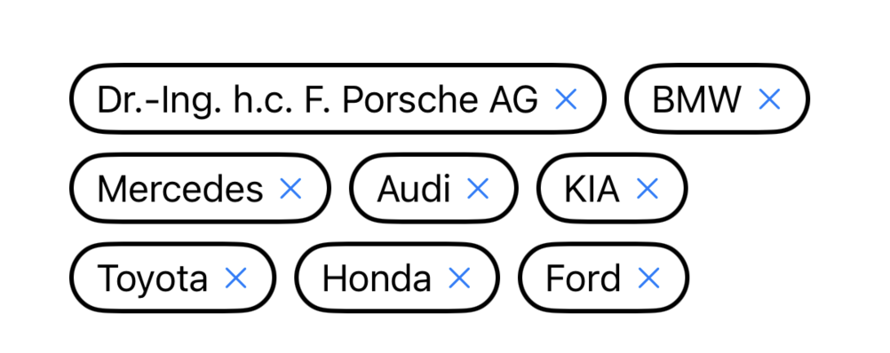
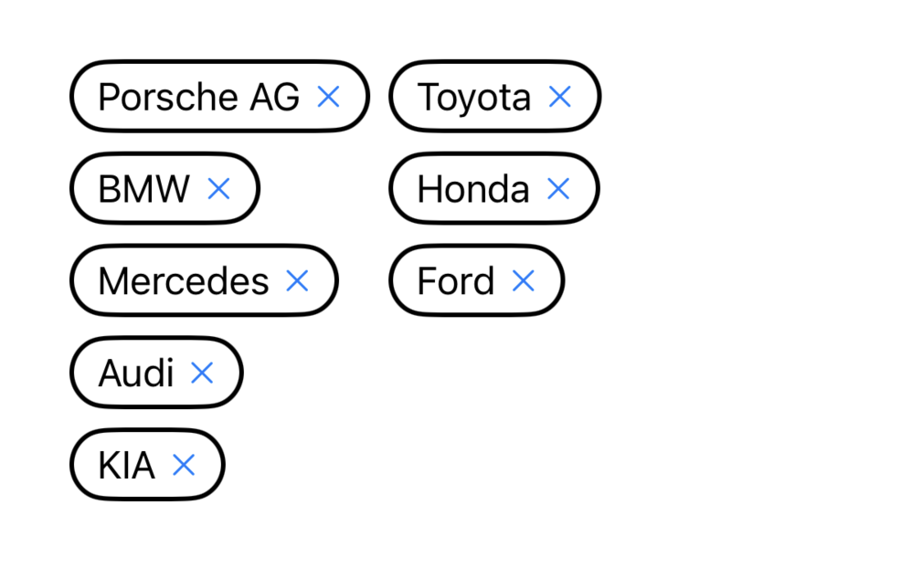

# Flow

[](https://github.com/c-villain/Flow/releases/latest)
[](https://swift.org/package-manager/)


[](https://t.me/lexkraev)
[](https://telegram.dog/swiftui_dev)

Flow is a SwiftUI package that provides a flexible layout component for arranging views in [horizontal rows](https://github.com/c-villain/Flow#flowhstack) or [vertical columns](https://github.com/c-villain/Flow#flowvstack) with automatic wrapping.

## FlowHStack

SwiftUI layout component that arranges views in horizontal rows and wraps them into new lines when needed

<p align="left">

</p>

A ``FlowHStack`` automatically wraps its content to a new row when it exceeds the available width, similar to text wrapping or [`FlowRow`](https://developer.android.com/develop/ui/compose/layouts/flow) in Jetpack Compose or [`flex-wrap`](https://developer.mozilla.org/en-US/docs/Web/CSS/flex-wrap) in CSS. The number of lines can be limited via the ``maxLines`` parameter.

```swift
FlowHStack {
    ForEach(tags, id: \.self) {
        Text($0)
    }
}
```

### Layout behavior

The component adapts its layout dynamically based on the container's width and the size of child views.

It also supports alignment customization both **within rows** and **across rows** using the appropriate parameters.


You can configure alignment:
- Use `horizontalAlignment:` to control how each row is aligned relative to the whole layout (e.g. `.leading`, `.center`, `.trailing`)
- Use `verticalAlignment:` to align views **within** a row (e.g. `.top`, `.center`, `.bottom`)

```swift
FlowHStack(
    horizontalAlignment: .center,
    verticalAlignment: .top
) {
    ...
}
```

### Customizing spacing

You can control the spacing between elements and rows:

```swift
FlowHStack(
    horizontalSpacing: 12,
    verticalSpacing: 8
) {
    ...
}
```

### Line count tracking

To observe or constrain the number of visible lines, use the `maxLines:` and `lineCount:` parameters:

```swift
@State private var lineCount: Int = 0

FlowHStack(maxLines: 2, lineCount: $lineCount) {
    ...
}
```

## FlowVStack

Layout component that arranges views in vertical columns and wraps them into new columns when needed.

<p align="left">

</p>

A ``FlowVStack`` automatically wraps its content to a new column when it exceeds the available height, similar to column wrapping in grid systems or [`FlowColumn`](https://developer.android.com/develop/ui/compose/layouts/flow) in Jetpack Compose. The number of columns can be limited via the maxColumns parameter.


A ``FlowVStack`` automatically wraps its content to a new column when it exceeds the available height, similar to `flow` in CSS but oriented vertically. The number of columns can be limited via the ``maxColumns`` parameter.

```swift
FlowVStack {
    ForEach(tags, id: \.self) {
        Text($0)
    }
}
```

### Layout behavior

The layout automatically adapts to the container’s height, distributing child views across columns and wrapping as needed.

You can configure alignment:
- Use `verticalAlignment:` to control how each column is aligned vertically (e.g. `.top`, `.center`, `.bottom`)
- Use `horizontalAlignment:` to align views **within** a column (e.g. `.leading`, `.center`, `.trailing`)

```swift
FlowVStack(
    horizontalAlignment: .center,
    verticalAlignment: .top
) {
    ...
}
```

### Customizing spacing

Use `horizontalSpacing:` and `verticalSpacing:` to define the spacing between columns and between items within each column:

```swift
FlowVStack(
    horizontalSpacing: 12,
    verticalSpacing: 8
) {
    ...
}
```

### Limiting and observing columns

You can restrict the number of rendered columns using `maxColumns:` and observe the actual column count with `columnCount:`:

```swift
@State private var columnCount: Int = 0

FlowVStack(maxColumns: 2, columnCount: $columnCount) {
    ...
}
```

If the provided content is empty, ``FlowVStack`` renders as `EmptyView` and does not occupy any space.

## Installation

#### Swift Package Manager

To integrate ```Flow``` into your project using SwiftPM add the following to your `Package.swift`:

```swift
dependencies: [
    .package(url: "https://github.com/c-villain/Flow", from: "0.1.0"),
],
```
or via [XcodeGen](https://github.com/yonaskolb/XcodeGen) insert into your `project.yml`:

```yaml
name: YourProjectName
options:
  deploymentTarget:
    iOS: 13.0
packages:
  Flow:
    url: https://github.com/c-villain/Flow
    from: 0.1.0
targets:
  YourTarget:
    type: application
    ...
    dependencies:
       - package: Flow
```

## Communication

- If you **found a bug**, open an issue or submit a fix via a pull request.
- If you **have a feature request**, open an issue or submit a implementation via a pull request or hit me up on **lexkraev@gmail.com** or **[telegram](https://t.me/lexkraev)**.
- If you **want to contribute**, submit a pull request onto the master branch.

👨🏻‍💻 Feel free to subscribe to channel **[SwiftUI dev](https://t.me/swiftui_dev)** in telegram.


